# 자료구조 & 알고리즘
## 1. 완전 탐색
1. 15651번. N과 M (3)
   - 중복순열 : 중복을 허용해서 순서 있게 나열하기
2. 15649번. N과 M (1)
   - 순열 : 중복없이 순서 있게 나열하기
3. 155652번. N과 M (4)
   - 중복조합 : 중복을 허용해서 고르기
4. 15650번. N과 M (2)
   - 조합 : 중복없이 고르기
5. 14888번. 연산자 끼워넣기
6. 9663번. N-Queen

### 연습문제
1. 1182번. 부분수열의 합
2. 1795번. 암호 만들기
3. <span style="color:red">13663번. N과 M (9)</span>

## 2. 정렬
1. 특성
   1. 같은 정보들은 입접해 있다.
   2. 각 원소마다, 가장 가까운 원소는 자신의 양 옆 중에 있다.
   3. N개의 원소를 정렬하는 것은 O(NlogN)의 시간 복잡도를 가진다.
2. 기본 자료형 정렬 - Dual-Pivot Quick Sort : in-place
   - 정렬 과정에서 N에 비해 충분히 무시할만한 메모리만 추가로 사용한다. 
   - 1부터 N까지 사용한다면, 동등한 위상의 원소들의 순서관계를 보장하지 않으므로,
   - Arrays.sort(a, 1, N+1)을 이용해 정렬을 수행해야한다.
3. 객체 정렬 - Time Sort :stable
   - 동등한 위상의 원소들의 순서 관계가 보장된다.

### 기본 문제
1. 10825번. 국영수
2. <span style="color:red">1015번. 수열 정렬 </span>
3. 11652번. 카드
4. 15970번. 화살표 그리기

### 연습문제
1. 1181번. 단어 정렬
   ```java
       static void pro() {
        Arrays.sort(a, new MyComparator());
        for (int i = 0; i < N; i++) {
            if (i == 0 || a[i].compareTo(a[i - 1]) != 0)
                sb.append(a[i]).append('\n');
        }
        System.out.println(sb.toString());
    }
   ```
   ```java
       static void pro() {
       // 정렬 조건에 맞게 단어를 정렬하기
       Arrays.sort(a, (o1, o2)-> o1.length()!=o2.length()?o1.length()-o2.length():o1.compareTo(o2));

        // 출력하기
        String s="";
        for (String str: a) {
            if(!s.equals(str)) {
                sb.append(str).append('\n');
                s=str;
            }
        }
        System.out.println(sb);
    }
   ```
2. 20291번. 파일 정리
   - TreeMap 이용
   ```java
    static TreeMap<String, Integer> map=new TreeMap<>((o1,o2)-> o1.compareTo(o2));

    static void input() {
        N = scan.nextInt();
        a = new String[N + 1];
        for (int i = 1; i <= N; i++) {
            // 입력된 파일 이름을 . 을 기준으로 나눠서 확장자를 가져오기
            String t=scan.next();
            String[] tmp=t.split("\\.");
            map.put(tmp[1], map.getOrDefault(tmp[1], 0)+1);
        }
    }

    static void pro() {
        // TODO: 확장자마다 몇 번 나타났나 count 하기
        for(String str:map.keySet()){
            sb.append(str).append(" ").append(map.get(str)).append("\n");
        }
        System.out.println(sb);
    }
   ```
   - 배열 이용하는 경우 : j가 N까지 돌고, 같은게 없으면 i가 j부터 시작. 따라서, i는 증가하지 않는다.
   ```java
       static void pro() {
        // TODO: 확장자마다 몇 번 나타났나 count 하기
        //1. 정렬 -> 문자의 오름차순 정렬(사전순)
        Arrays.sort(a, 1, N+1);
        //2. 정렬했을때 같으면 카운트 -> i를 증가시키지 않는다. 왜냐하면 다를 때는 j부터 시작해야하므로
        for(int i=1;i<=N;){
            int cnt=1;
            int j=i+1;

            //3. i를 기준으로 같은 경우가 있는지 j로 탐색해서 카운트
            for(;j<=N;j++) {
                //사전순이므로 같은경우엔 모두 붙어있다. -> 다르면 break;
                if (a[j].compareTo(a[i]) == 0) cnt++;
                else break;
            }
            sb.append(a[i]).append(' ').append(cnt).append('\n');

            // 4. a[j] 가 a[i]랑 다를 때는, 다음 i가 j 부터 시작한다.
            i = j;
        }
        System.out.println(sb);
    }
   ```

## 3. 이분 탐색
### 정렬이 되어있지 않은 수열과 탐색 대상 X가 갖는 질문 - O(N)
1. X가 존재하는가
2. X[이하, 이상, 초과]의 원소는 몇개가 있는가
3. X랑 가장 가까운 원소는 무엇인가

### 정렬이 되어 있는 수열과 탐색 대상 X가 갖는 질문 - O(logN)
- 이분 탐색으로 같은 질문을 더 빠르게 해결할 수 있다.

### 이분 탐색 구현을 위한 변수
1. L := 탐색할 가치가 있는 범위의 왼쪽 끝 인덱스
2. R := 탐색할 가치가 있는 범위의 오른쪽 끝 인덱스
3. Result := 탐색한 X의 위치
4. 탐색 목표 := X이하의 원소 중에 가장 오른쪽에 있는 원소
   - L=1, R=9, M=(L+R)/2=5 -> A[M]과 X를 비교
   - L<=R이면 계속 반복, 즉 L>R이면 종료
   - A[M]<X -> L = M+1=6, R=9
   - A[M]>=X -> L=1, R = M-1=4;
   - N이 10만일 때, 10만과 16으로 시간 복잡도의 엄청난 차이가 존재하게 된다.

### 이분 탐색 주의 할점
1. 정렬하지 않는 경우
2. L, R, M, Result를 사용해 부등호를 잘못 사용하는 경우
3. L, R의 범위를 잘못 설정하거나, Result의 초기값을 잘못 설정하는 경우

### 기본 문제
1. 7795번. 먹을 것인가 먹힐 것인가
2. 2470번. 두 용액

### 연습 문제
1. 1920번. 수 찾기
2. 1764번. 듣보잡
3. 3273번. 두 수의 합
4. 10816번. 숫자 카드 2


### 이분 탐색의 아이디어 - 매개변수 탐색
1. 매개변수를 만들기
2. 만든 매개변수로 문제에 해당하는 YES/NO 조건 만들 수 있는가?
3. <span style="color:red">정렬된 상태인지 확인하고 정렬이 필요하면 정렬한다. </span>
4. 바꾼 문제가 더 풀기 쉬우면, 매개변수 탐색 수행해서 해결
   - 정렬하고, 매개변수를 정렬했으니까 왼쪽부터 차례대로 결정하고, 이분탐색한다.
   - O(NlogN), O(N), O(logX) = O(NlogN+NlogX)

### 기본 문제와 해당하는 연습 문제
1. 2805번. 나무 자르기
   1. 1654번. 랜선 자르기
   2. 2512번. 예산
2. 2110번. 공유기 설치
   1. 2343번. 기타 레슨
   2. 6236번. 용돈 관리
   3. 13702번. 이상한 술집 
   4. 17266번. 어두운 굴다리

   
### 연습문제 (Hard)          
1. 1300번. K번째 수
2. 1637번. 날카로운 눈

## 4. 두 포인터
1. 정답을 찾기 위해 찾는 영역(or 과정)을 줄일 수 없을까?
2. 필요한 부분만 (or 빠르게) 탐색
3. 정답을 찾기 위해 탐색해야하는 영역을 줄여서 꼭 필요한 부분만 탐색하도록 하자.

### 투 포인터
- 화살표 두 개에 의미를 부여해서 탐색 범위를 압축한다.
  1. 1차원 배열 위에 2개의 포인터를 만드는 경우
     1. 2개의 포인터가 모두 왼쪽에서 시작해서 **같은 방향**으로 이동
     2. 2개의 포인터가 양 끝에서 **서로를 향해** 이동
  2. 배열로 주어지진 않지만, 관찰을 통해 등장하는 **변수 2개의 값**을 투 포인터로 표현하는 경우

- 투 포인터 키워드
  1. 1차원 배열에서의 "연속 부분 수열" or "순서를 지키며 차례대로"
     - 배열을 모두 보는 게 아니라, 필요한 부분만 압축해서 탐색한다.
  2. 곱의 최소
     - A*B의 최소화를 하기 위해서는, A 커지면, B는 작아져야한다.

- 접근하기
  1. 왼쪽 시작 L을 결정 : O(N)
  2. 오른쪽 끝 R을 L부터 시작해서 이동 : O(N)
  3. O(N^2)
- 넣었다가 뺐다가 -> **++R, R+1, R++**
  1. 왼쪽 시작 L을 결정 : O(N)
  2. 한번만 오른쪽 끝 R을 L부터 시작해서 이동
  3. 커지면 맨 앞부터 빼면서, 작거나 같으면 다음 값부터 추가하면서 탐색한다.

```java
while(R+1<=n&&sum<S){
    R++;
    sum+=a[R];
}

while(R+1<=n&&sum<S){
   sum+=a[++R];
}
```
### 응용 문제 (1) : 두 용액 
#### 이분 탐색을 투포인터로
1. L := "남아 있는 것들 중" 제일 작은 원소
2. R := "남아 있는 것들 중" 제일 큰 원소
#### 현재 남아있는 최솟값+최댓값을 계산을 반복한다.
- 숫자가 하나만 남으면 종료
  1. 최소+최대 <0 -> 최소 입장에서는 최선이므로, 최소를 삭제
  2. 최소+최대 >0 -> 최대 입장에서는 최선이므로, 최대를 삭제
  3. 최소+최대=0 -> 정답이므로 출력
#### 접근법
   1. 매 순간 L,R을 찾는다 -> O(N)
   2. 원소가 1개가 될때까지 반복 -> N번 반복
   3. O(N^2)
#### 정렬과 투포인터로 최솟값과 최댓값을 빠르게 찾는다.
- 정렬된 상태이면, 항상 왼쪽이 최솟값 오른쪽이 최댓값이므로 
- L=R이 되면 서로 다른 용액을 못찾으므로 종료
#### 투포인터를 이용했을 때의 시간 복잡도
1. 정렬 -> O(NlogN)
2. 매순간, L,R로 계산해서 이동시킨다. -> O(N)
3. O(NlogN)

### 응용 문제 (2) : List of Number Unique Numbers
#### 수열에서 연속한 1개 이상의 수를 뽑았을 때 같은 수가 여러 번 등장하지 않은 경우의 수
1. 정답의 최대치 : N이 10만이면 모든 연속 구간이 카운트 ->N+(N-1)...= 50억
   - 따라서 long 타입 사용해야한다.
2. 접근법 (1)
   1. 왼쪽 시작 L 결정 : O(N)
   2. 오른쪽 끝 R을 L부터 시작해서 이동 : O(N)
   3. R을 이동해서 추가된 원소가 [L, R-1] 안에 있는지 확인 : O(N)
      - O(N^3)으로 시간 복잡도를 낮추는 방법 모색해야함
      - 투 포인터를 이용해 꼭 필요한 부분만 탐색하기
3. 접근법 (2)
   1. 왼쪽 시작 L 결정 : O(N)
   2. 오른쪽 끝 R을 L부터 시작해서 이동 : O(N)
   3. 숫자마다 [L, R]안에 몇 개나 있는지 직접 센다.
      - 각 원소가 1부터 10만 사이이므로, 해당 값을 카운팅하는 배열을 만든다.
      - 상수 시간으로 처리가능 : O(1)
   4. O(N^2) -> N이 10만이므로 시간초과
4. 접근법 (3)
   - 1~3까지 중복된게 없다면, 2~3까지도 당연히 중복된게 없다.
     1. R을 이동 가능한 끝까지 이동시키면서 카운팅
     2. 개수를 센다.
     3. L-1을 카운팅에서 제외한다.
   - 정리
     1. 왼쪽 시작 L의 이동 횟수 N번
     2. 오른쪽 끝 R을 이전 R부터 시작해서 이동
     3. L,R이 각자 최대 N번 이동한다. : O(N)
   - 결론
     1. 왼쪽 시작 L 결정 : O(N)
     2. 오른쪽 끝 R을 이전의 R부터 시작해서 이동
     3. R을 이동해서 추가된 원소가 [L, R-1] 안에 있는지 확인 : O(1)
     - O(N) 

### 응용 문제 (3) : 좋다
1. 접근법
   1. 타겟 수 결정 : O(N)
   2. 다른 수 2개 결정해서 만들어지나 확인 : O(N^2)
   3. O(N^3)
2. 투 포인터 적용
   1. 정렬 수행 : O(NlogN)
   2. 타겟 수 결정 : O(N)
   3. 다른 수 2개 결정해서 만들어지나 확인 : O(N)
      - 타겟 숫자와 가까운걸 찾는다.
      - O(N^2)

### 응용 문제 (4) : 고냥이
- 최대 N개의 종류의 알파벳을 가진 연속된 문자열만 인식
- 인식할 수 있는 최대 문자열의 길이? = kind
- 즉, while(kind>N) 반복해서 L을 이동시키면서 조건을 성립하는 최대 문자열의 길이를 찾는다.
- kind를 계산하는 방법
  1. for문으로 돌면서 kind를 O(26)으로 계산하는 방법
  2. kind를 O(1)으로 계산하는 방법
     - 기준 : kind가 바뀌는 기점은 cnt라는 배열에 변화가 발생할 때 
     - 접근 : add, erase 메서드 호출시 cnt라는 배열이 변화한다. 
     - 구현 : add와 erase 메서드 호출했을 때, 
       1. add의 경우, 파라미터에 해당하는 배열 값이 1이 될 때 -> 0에서 1로 변화했을때 kind++ 
       2. erase의 경우, 파라미터에 해당하는 배열 값이 0이 될 때 -> 1에서 0으로 변화했을때 kind--;

## 기본 문제
1. <span style='color:red'> 1806번. 부분합</span>
2. 2470번. 두 용액

## 연습 문제
1. 3273번. 두 수의 합

## 응용 문제
1. 13144번. List of Unique Numbers
2. 1253번. 좋다
   - 2473번. 세 용액
3. 16472번. 고냥이

### 연습 문제
1. 2003번. 수들의 합 2
2. 2559번. 수열
3. 15565번. 귀여운 라이언
4. 11728번. 배열 합치기
5. 2230번. 수 고르기


## 5. 그래프 탐색 (DFS & BFS)
### 인프런
#### 기초 (재귀함수, 트리, 그래프)
 1. 재귀함수 (스택프레임)
 2. 이진수 출력 (재귀 함수)
 3. 팩토리얼
 4. 피보나치 재귀 (메모이제이션)
 5. 이진트리 순회 (DFS)
 6. 부분집합 구하기 (DFS)
 7. 이진트리 레벨탐색 (BFS)
 8. 송아지 찾기1 (BFS)
 9. Tree의 말단 노드까지 가장 짧은 경로 (DFS)
 10. Tree의 말단 노드까지 가장 짧은 경로 (BFS)
 11. 그래프와 인접 행렬
 12. 경로탐색 (DFS)
 13. 경로탐색 (인접리스트)
 14. 그래프 최단 거리 (BFS)
#### 심화


### 백준
1. 기본 구현
   - 1260번. DFS와 BFS
2. 격자형 그래프
   - 2667번. 단지번호 붙이기
   - 1012번. 유기농 배추
   - 11724번. 연결 요소의 개수
   - 4963번. 섬의 개수
   - 3184번. 양
3. 일반 그래프
   - 2606번. 바이러스
   - 11403번. 경로 찾기
   - <span style="color:red"> 11725번. 트리의 부모 찾기 </span>
   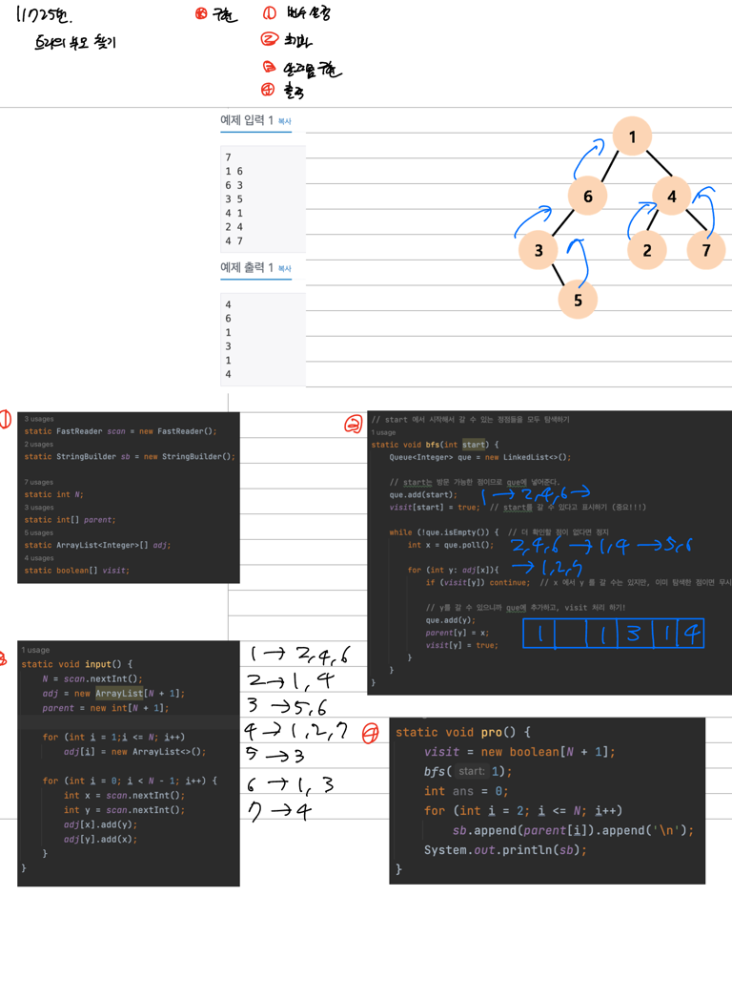
   - <span style="color:red"> 13023번. N명의 친구 </span>
   - ```java
         public static void main(String[] args) {
        Scanner in = new Scanner(System.in);
        String s = in.nextLine();
        int N= Integer.valueOf(s.split(" ")[0]);    //사람의 수
        int M= Integer.valueOf(s.split(" ")[1]);    //관계의 수

        //인접 리스트 방식을 사용해 그래프 구현
        List<List<Integer>> graph = new ArrayList<>();
        //리스트 초기화
        for(int i=0;i<N;i++){
            graph.add(i, new ArrayList<>());
        }
        //리스트에 노드 삽입
        for(int i=0;i<M;i++){
            s=in.nextLine();

            //양방향 관계인 친구관계를 표현하기 위해
            //String to Int = " "기준 분리 후 -> valueOf로 변환
            int a = Integer.valueOf(s.split(" ")[0]);
            int b = Integer.valueOf(s.split(" ")[1]);

            graph.get(a).add(b);
            graph.get(b).add(a);
        }

        //방문 여부 배열
        boolean[] visited = new boolean[N];

        //어느 친구(정점)부터 시작하냐에 따라 달라질 수 있으므로
        //: DFS를 이용해 반복문으로 돈다
        for(int i=0;i<N; i++){
            //자기자신을 포함시켜야하므로
            dfs(graph, visited, i ,1);

            if (found) {
                System.out.println("1");
                return;
            }
        }
        System.out.println("0");
     }
        static void dfs(List<List<Integer>> graph, boolean[] visited, int v, int depth){
        //종료 조건 먼저
        if(depth==5){
        found =true;
        return;
        }

        //해당 vertex와 연결된 노드를 방문할 것이므로,해당 노드를 제외할 수 있도록 방문했다고 체크
        visited[v]=true;
        //해당 노드와 연결된 노드를 방문
        for(int vertex : graph.get(v)){
            //방문하지 않은 노드에만 방문하도록
            if(!visited[vertex]){
                dfs(graph, visited, vertex, depth+1);
            }
        }
        //해당 vertex와 연결된 노드를 방문을 다 했으므로, 다른 노드에서 해당 노드를 다시 방문할 수 있도록 방문했다는 걸 체크해제
        visited[v]=false;
        //: 탐색의 순서가 달라지더라도 방문했던 노드를 다시 방문하지 못하면 원하는 뎁스를 가진 경로를 찾을 수 없다.
     }
     ```
    
4. 그래프로 만들기
- 주어진 조건에서 정점과 간성르 정의해서 그래프적인 관점에서 문제를 푸는 방법

### 기본 문제 (1) -물통
- A=0, B=0, C=Limit에서 시작 : 물통 A가 비어있을 때, 가능한 모든 C의 물양
    - 정점의 상태를 나타내는 값이 숫자 3개로 표현이 된다.
    - 상태를 저장하는 구조체를 작성 후, 구조체 안에 상태를 변화시키는 행위를 작성한다.
    - State: 물통이라는 정점들의 상태와 행위를 담고 있는 구조체
    - BFS : 구조체인 물통을 큐에 담아서 탐색 시작
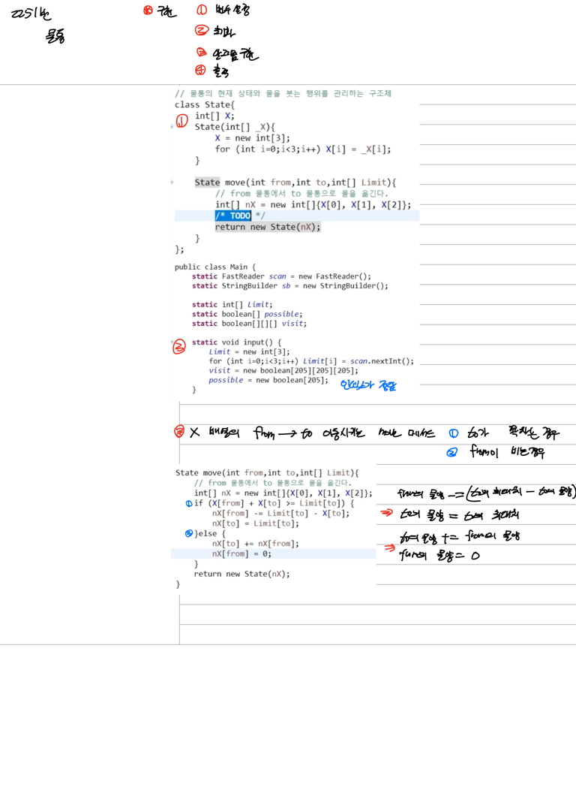
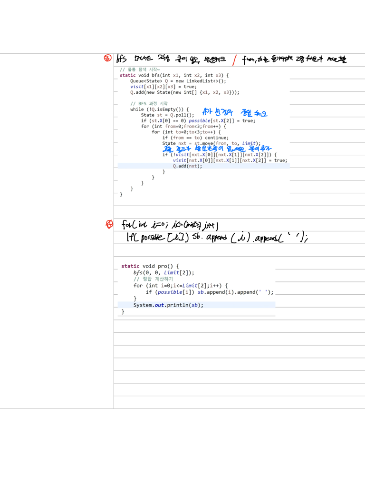
  
#### 기본 문제 (2) -숨바꼭질
- 수빈이는 -1, +1, *2칸 이동 가능하고, 동생한테 도착하는 최소 이동 횟수를 구해야한다.
  - 가장 빠른 시간 -> 주어진 정보로 정점과 간선을 정의해 BFS
  - 가장 빠른 시간 -> BFS 최소 이동 횟수 -> 그래프 만들기
  - 정점은 하나의 상태를 나타낸다.
    - 동생은 변하지 않고 고정된 정점
    - 수빈은 변화하는 정점
  - 간선은 수빈이의 이동을 나타낸다.
    - 각 정점에서 이동 방법 3가지의 간선을 생성한다.
    - 단방향 간선
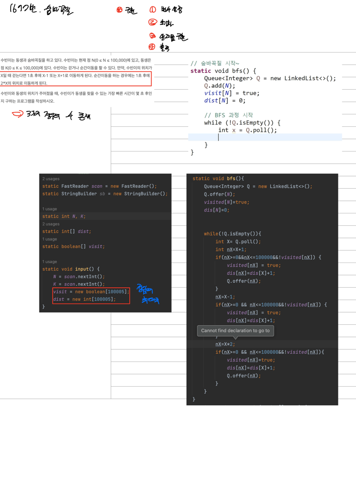

#### 기본 문제 
   1. 2251번. 물통 
   2. 1697번. 숨바꼭질
   
#### 연습 문제
   - <span style="color:red"> 1389번. 케빈 베이컨의 6단계 법칙 </span>
   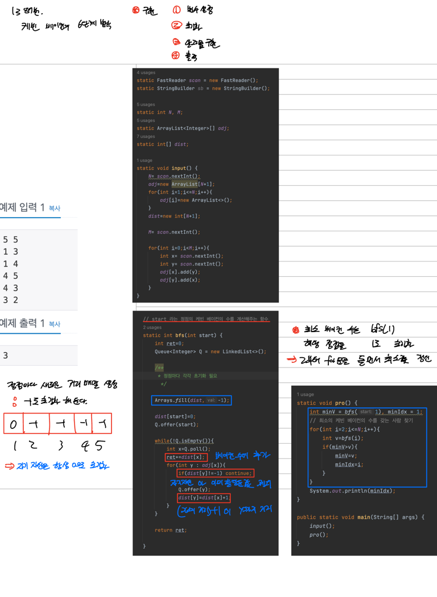
   - <span style="color:red"> 5567번. 결혼식 
   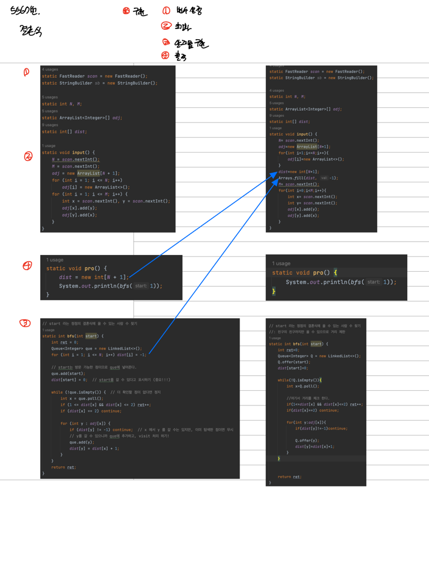


5. 멀터 소스 BFS (시작점이 여러개인 BFS)
   - 14502번. 연구소
   
6. 최소 이동 거리 BFS
   - 2178번. 미로 탐색
   - 7562번. 나이트의 이동
   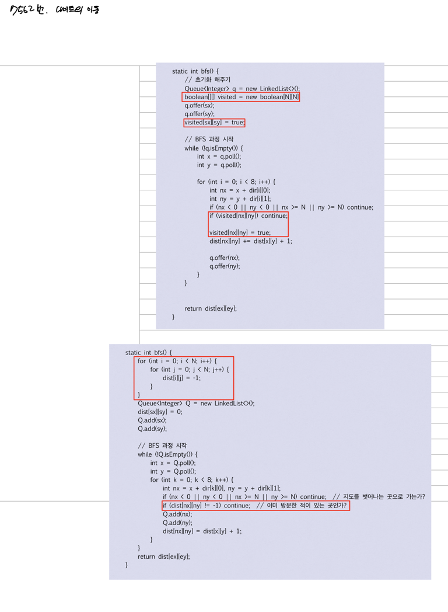
   - 2644번. 촌수 계산
   - 18404번. 현명한 나이트
7. 더블 BFS
   - 3055번. 탈출 (멀티소스 BFS이기도 함)
   - <span style="color:red"> 7569번. 토마토</span>
   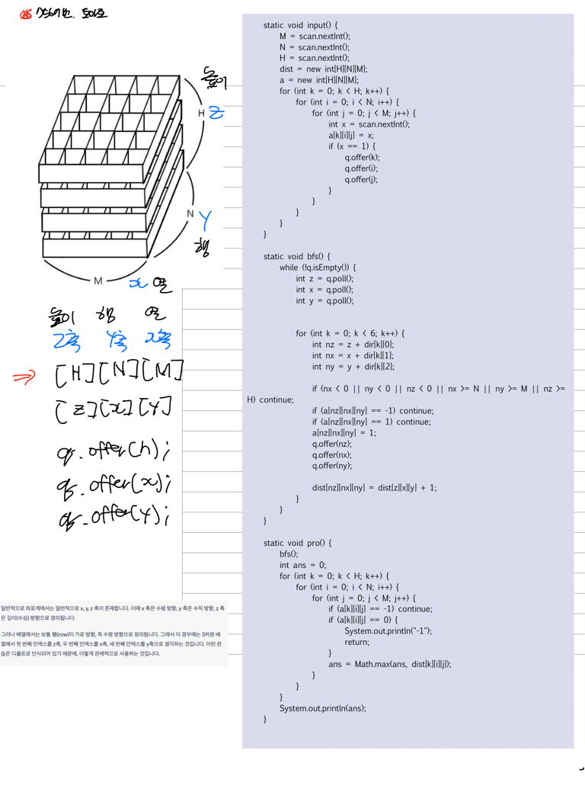

## 6. 트리
### 키워드
1. 두 정점 사이의 경로가 존재하고, 사이클이 존재하지 않는 경우만 고려한다.
2. 정점과 정점 사이를 잇는 N-1개의 간선이 존재하며, 모든 정점은 연결되어 있다.
3. 정점들이 모두 연결되어 있고, 사이클이 없는 그래프, 정점의 개수는 N이고 간선의 개수는 N-1개

### 아래의 특성 중 2개 이상 만족할 경우 트리
1. 모두가 연결되어 있어서 어떤 두점을 골라도 간선을 타고 서로 이동 가능
2. 사이클이 존재하지 않음
3. 정점 개수 |V| = 간선 개수 |E|+1

### 트리와 루트 트리
1. 트리에는 루트가 존재하는 경우와 루트가 존재하지 않는 경우가 존재
2. 트리가 존재하는 경우, 트리의 깊이를 기준으로 루트로부터의 거리에 대한 조건을 참고해 문제를 푼다.
3. 루트트리에는 조상, 자식, 형제, 말단 노드가 존재한다.
4. 일반적인 알고리즘 문제에서는 루트 트리를 이용한다. 
5. |V|=|E|+1이므로, 인접행렬로 만든다면 |V|의 제곱으로 공간복잡도 낭비

### 백준
1. 구현 (루트가 없는 트리에서 루트 만들기)
   - 11725번. 트리의 부모 찾기
   - <span style="color:red"> 4803번. 트리</span>
2. DFS를 이용하는 동적계획법
   - 1068번. 트리 (단말 노드의 개수(BFS/DFS)로도 가능)
   - 15681번. 트리와 쿼리
   - 14267번. 회사 문화1
3. BFS
   - 1991번. 트리 순회
   - 5639번. 이진 검색 트리
   - 9489번. 사촌
   - 20364번. 부동산 다툼
4. LCA (최소 공통 조상) 
   - 3584번. 가장 가까운 공통 조상
   - 1240번. 노드 사이의 거리
5. 최소신장트리 (크루스칼 알고리즘)
   - 15900번. 나무 탈출 (BFS도 가능)


## 위상 정렬
- Directed Acyclic Graph (DAG)
1. 방향성이 있는 Cyclic이 없고,정점(V) + 간선(E)으로 이루어진 그래프
2. 차수
   - 방향성이 있는 그래프에서의 차수
   - Indegree / Outdegree
   - 해당 정점이 도착지가 되는 간선의 개수, 해당 정점에서 나가는 간선의 개수
- DAG에서만 가능한 위상 정렬
1. 정점들을 위상에 맞게 정렬한다.
2. 위상이란 간선의 방향성을 조건으로 삼아서 방향성을 기준으로 정렬을 수행한다.
3. 즉, 정점들의 번호를 수열로 만들어 정렬을 한다.
4. 정렬 조건
   1. 출발지 -> 도착지가 존재한다면, 출발지가 도착지보다 먼저 나타나야함
   2. 즉, 간선 하나하나마다 어떤 정점이 다른 정점보다 먼저 나타나야 한다는 조건이 필요하다.
   3. 모든 정점들이 조건을 만족하면, 위상 정렬 가능
   4. 사이클이 존재하다면 어떻게 해도 해당 조건을 만족하지 않는다. -> 위상 정렬 불가능

### 접근법
1. 제일 먼저 올 수 있는 정점이 뭘까
  - 들어오는 간선이 없는 정점
2. 제일 먼저 올 수 있는 정점들의 후보들을 담아둔다.
3. 후보들을 이용해서 정렬 시작
   - 해당 정점은 그래프에서 삭제
   - 해당 정점과 관련된 간선도 함께 삭제
   - 그 상태에서 가장 먼저 올 수 있는 정점을 찾는다.
4. 하나씩 정렬시키면서 그래프에서 삭제하는 작업 반복

### 구현
1. 정점들의 Indegree인, Indeg[1...N] 계산 -> O(|E|) (간선 수만큼)
2. 들어오는 간선이 0인, 즉 Indege[i]==0인 정점들을 찾아서 자료구조 Queue에 담는다. -> O(|V|) (정점 수만큼)
   - 원소를 추가하기
   - 원소를 꺼내기
3. D가 빌 때까지 반복 
   1. D에서 원소 X를 꺼내서 정렬
   2. Graph에서 정점 X 제거 (연관된 간선도 제거)
   3. **새롭게 정렬 가능한 점을 찾아서 D에 추가**
      1. for문을 돌면서 모두 확인 -> O(|V|^2) (while, for, for : 정점 개수만큼 반복하는데, 간선의 개수만큼 반복 그 때마다 모든 정점을 확인)
      2. 정점 X 제거할 때, 즉 변경이 발생할 때만 indeg[y]==0이 될 수 있으므로 그때만 확인 -> O(|E|) (간선 개수만큼만 반복)

```java
while(!queue.isEmpty()){
    int x = queue.poll();
    sb.append(x).append(' ');
    for(int y : adj[x]){
        indeg[y]--;
    }
    for(int i = 1; i <= N; i++){
        if(i가 새롭게 indeg[i]==0 이라면) queue.add(i);
    }
}
```

```java
while(!queue.isEmpty()){
    int x = queue.poll();
    sb.append(x).append(' ');
    for(int y : adj[x]){
        indeg[y]--;
        if (indeg[y] == 0) queue.add(y);
    }
}
```
#### 기본 문제
1. 2252번. 줄 세우기
2. 1005번. ACM Craft

#### 기본 문제 (1) - 줄 세우기
1. 학생들의 키 관계가 주어진다.
2. 관계 -> 그래프 -> 정렬 -> 위상 정렬
3. 위상 정렬을 위해 그래프를 만든다.

#### 그래프 만들기 - 인접 리스트 O(V+E)
   - 정점 (V) := i번 학생
   - 간선 (E) := x번 학생이 y번 학생보다 먼저 서야한다. (x번 학생 키가 y번 학생 키보다 작다.)
1. x->y로 그래프를 만든다.
2. y로 들어가는 Indegree 배열값을 증가시킨다.
3. 차수가 0이 아닌 정점들을 Deque에 넣는다.
4. Deque가 빌 때까지 반복
   1. 뺀 정점을 정렬 결과에 추가
   2. 해당 정렬의 리스트 (=해당 정점이 시작점으로 하는 도착점들의 자료구조)에서 차수를 줄인다. (간선을 제거한다.)
   3. 새롭게 차수가 0이 된 정점들을 큐에 추가한다.

#### 연습 문제 (1)
1. 2623번. 음악 프로그램
2. 9470번. Strahler 순서
3. 14767번. 영우는 사기꾼?

#### 기본 문제 (2) - ACM Craft
1. 건물, 건설 규칙, 건설 시간
   - 건설해야하는 건물 4개
   - 각 건물마다 건설 시간이 다르다.
   - 건물마다의 건설 규칙이 존재
     - 선행되어야하는 조건이 존재
     - 먼저 다른 건물이 지어져야 건설 가능
2. 따라서 여러 건물들이 동시에 건설이 가능
3. 모든 건물들이 지어질 때까지 걸리는 최소 시간 =  max(T_done[X의 선행작업]) + T[X]
4. 위상정렬 순서로 T_done을 계산해나가야한다.
5. 테스트케이스가 여러개인 문제인 경우 -> 배열 초기화에 유의해야한다.
6. 위상 정렬상 앞에 오는 경우 -> 해당 건물의 건설 속도 = 해당 건물의 건설에 걸리는 시간
7. X -> Y의 간선을 지을 때,  Y에 X를 건설하는 데 걸리는 시간 추가해야한다. : max(T_done[Y의 선행작업], T_done[X의 선행작업]+T[Y])

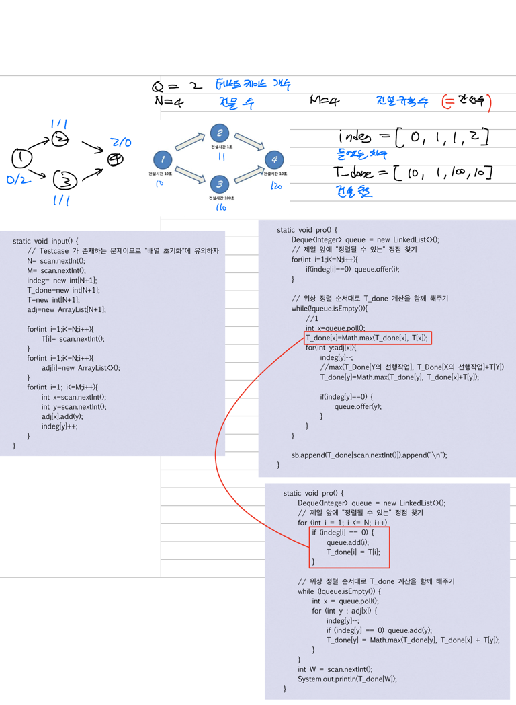

#### 연습 문제 (2)
1. 1516번. 게임 개발
2. 2056번. 작업
3. 2637번. 장난감 조립


## 최단 경로 / 최단 거리 (Shortest Path)

| 이름             | 간선의 가중치 | 시작점   | 도착점   | 시간복잡도    |
|----------------|---------|-------|-------|----------|
| BFS            | 모두 1    | 한 정점  | 모든 정점 | O(V+E)   |
| Dijkstra       | \>=0    | 한 정점  | 모든 정점 | O(ElogV) |
| Floyd-Warshall | 제약 없음   | **모든 정점** | 모든 정점 | O(V^3)   |
| Bellman-Ford   | 제약 없음   | 한 정점  | 모든 정점 | O(V*E)   |
| SPFA           | 제약 없음   | 한 정점  | 모든 정점 | O(V*E)   |
| A*             | \>=0    | 한 정점  | **한 정점**  | O(b^d)   |
1. 그래프의 시작점에서 다른 지점까지의 최단 거리
2. BFS와 다익스트라 알고리즘이 자주 사용된다.
   1. 간선의 가중치가 존재하지 않을 때만 사용가능한 BFS
   2. 간선의 가중치와 관계없이 사용가능하지만 시간 복잡도가 높은 다익스트라 알고리즘

### 그래프 탐색 방법 중 하나인 BFS
1. 시작점에서 간선을 0개 이상 사용해서 갈 수 있는 정점들은 무엇인가 - DFS / BFS
2. 다른 정점까지 최소 이동 횟수를 계산 할 수 있는 BFS - 이동 횟수의 합이 최소 이동 횟수로 간선의 가중치는 1

### 양수인 간선의 가중치를 이용해서 최단 경로를 계산할 수 있는 **다익스트라 알고리즘**
1. 멀티 소스 BFS와 같이 멀티 소스 다익스트라도 가능
2. 다익스트라 알고리즘 한번에 시작점에서 모든 점까지의 최단 경로의 거리를 구할 수 있다.
3. 도착점과 관계없이 시작점만 주어진다면, 모든 점까지의 최단 거리를 구한다.
4. 정점에 대해서 단 한번만 방문한다.
4. O(ElogV)

### 다익스트라 알고리즘을 사용하기 위한 조건
1. dist[i] := 시작점에서 i번 정점까지 가능한 최단 거리
2. 자료구조 D := {(v,d) | 시작점에서 v까지 d만에 갈 수 있다는 정보를 담은 자료구조|


### 다익스트라 알고리즘의 슈도 코드
1. 변수 초기화와 자료구조 초기화 및 자료구조에 넣을 데이터 정의
   - dist[i] 초기화 : i까지의 가는 최단 경로 / 최단 거리 배열
     1. 시작점에서 시작점까지 거리는 0
     2. 시작점에서 다른 점까지의 거리는 모두 최댓값
     3. 자료구조 D에 시작점 정보를 추가 (S,0)
2. 자료구조 D 빌 때까지 반복
   1. D에서 가장 작은 d (v,d)를 꺼낸다.
   2. **뽑은 d의 가치 정보 확인**
      - dist[v] < d인지 확인하는 작업
      - v까지의 최단 거리보다 d가 크다면, 이미 가치가 없는 정보
      - 더 오래 걸리는 경로로, 폐기한다.
   3. 뽑은 d의 정보로, 새로운 정보를 D에 추가
      - d와 연결된 간선 정보를 자료구조에 추가
      - if( d+c < dist[w]) dist[w] = d+c
      - 자료구조 D에 (w, d+c)를 추가
      - 즉, 같은 경로를 더 짧은 거리로 갈 수 있는 거리로 갱신
        - **w까지가는 경로 dist[w]를 더 짧은 경로로 갱신하는 작업**
### 시간 복잡도
1. v,d를 통해 새로운 정보를 D에 추가하는 시간  : T*N 
2. D에서 mid(v,d) 추출하는데 걸리는 시간    :  T*N
3. T = T1*N1 + T2*N2

### 시간 복잡도 계산
1. N2 : D에서 원소가 추출되는 횟수, N1: D에 원소가 추가된 횟수
2. N2<= N1 : 추출된 횟수는 추가된 횟수보다 같거나 작을 수 밖에 없다.
3. T <= [T2+T1]*N2
   - N2 := deg(1) + deg(2)+ ... + deg(V) = |E| (간선의 개수)
      - 정점을 확인할 때마다 새로운 간선을 추가
      - 다익스트라의 특징은 모든 정점을 **최대 한 번씩**만 가치가 있는 v로 등장한다.
      - 모든 정점의 차수의 합은 간선의 개수와 같다.
4. T<= [T2+T1]*E
   - 자료구조에 원소를 빼는 시간, 자료구조에 원소를 추가하는 시간
   - 배열 : O(N), O(1)
   - 최소힙 / 우선순위 큐 : O(logE), O(logE) 
5. T <= O(ElogE) - 간선의 개수는 정점 개수의 제곱보다 갖거나 같다.
6. T = O(ElogV)

### 간선의 가중치가 음수가 되면 안되는 이유
1. 시간 복잡도가 보장되지 않기 때문에
2. (v,d)를 가치있는 경로만 구해야하지만, 음수인 경우 한 정점이 v로 추출되는 횟수가 1번으로 보장되지 않는다.
3. 즉, N(2) >> |E|      
   - 다익스트라의 모든 정점을 **최대 한 번씩**만 가치가 있는 v로 등장한다는 특징에 위배된다.

### 구현
- Info 클래스 : int idx, int dis
- 최소힙 PriortyQueue<Info> 
1. dist 배열 초기화, (S,0)을 D에 저장
   - dist배열을 무한대로 초기화
   - Info 클래스를 제네릭으로 하는 최소힙 생성하는데, 거리를 기준으로 오름차순
2. 초기값 설정
   - 시작점 정보를 최소힙에 추가
   - 거리 배열에 시작점을 0으로 갱신
3. 자료구조가 빌 때까지 반복
   - 최소 힙에서 꺼낸 정보의 가치 판단 (해당 정점의 거리가 최단 경로 배열보다 짧거나 같은지 확인)
   - 가치가 있는 정보면, 해당 정점에서의 모든 간선들이 최단 경로가 되는지 체크하고 큐에 추가
     1. for(Edge e : edges[info.idx]) 해당 정점의 간선 배열을 돌면서 간선 정보를 추가한다.
     2. if(dist[info.idx] + e.weight >= dist[e.to]) : 해당 정점에서의 간선정보들이 최단 경로가 되는지 체크
     3. dist[e.to] = dist[info.idx] + e.weight : e.to까지 갈 수 있는최단 경로 갱신한다. (해당 정점까지의 최단 경로 + 해당 간선의 가중치)
     4. pq.offer(new Info(e.to, dist[e.to])) : 정보를 갱신했으므로, 우선순위큐에 기록

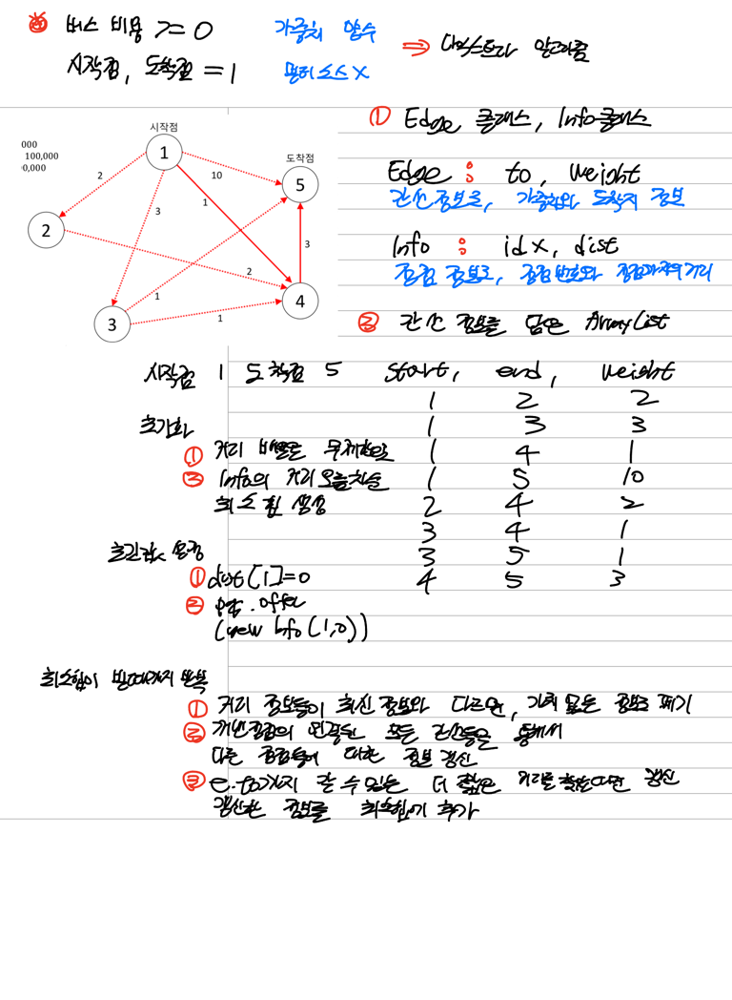

#### 기본 문제
1. 1916번. 최소비용 구하기
2. 1753번. 최단경로

```java
    static void dijkstra(int start) {
        // 모든 정점까지에 대한 거리를 무한대로 초기화 해주기.
        // ※주의사항※
        // 문제의 정답으로 가능한 거리의 최댓값보다 큰 값임을 보장해야 한다.
//        for(int i=1;i<=N;i++){
//            dist[i]=Integer.MAX_VALUE;
//        }
        Arrays.fill(dist,Integer.MAX_VALUE);

        // 최소 힙 생성
        PriorityQueue<Info> pq= new PriorityQueue<>(((o1, o2) -> o1.dist-o2.dist));

        // 시작점에 대한 정보(Information)을 기록에 추가하고, 거리 배열(dist)에 갱신해준다.
        Info startInfo = new Info(start, 0);
        dist[start]=0;
        pq.offer(startInfo);

        // 거리 정보들이 모두 소진될 때까지 거리 갱신을 반복한다.
        while (!pq.isEmpty()) {
            Info info = pq.poll();

            // 꺼낸 정보가 최신 정보랑 다르면, 의미없이 낡은 정보이므로 폐기한다.
            if(dist[info.idx]<info.dist) continue;

            // 연결된 모든 간선들을 통해서 다른 정점들에 대한 정보를 갱신해준다.
            for (Edge e : edges[info.idx]) {
                // e.to 까지 갈 수 있는 더 짧은 거리(같으면 안됨)를 찾았다면 이에 대한 정보를 갱신하고 PQ에 기록해준다.
                if(dist[e.to]>dist[info.idx]+e.weight){
                    dist[e.to]=dist[info.idx]+e.weight;
                    //idx, dist

                    //: e.to 정점과 e.to까지의 가중치를 최소힙에 추가
                    pq.offer(new Info(e.to, dist[e.to]));
                }
            }
        }

    }
```

## 동적 프로그래밍
- 문제의 크기를 변화하면서 정답을 계산한다.
- 바텀업 방식인 상향식 접근법으로 **작은 문제의 결과를 이용**해서 큰 문제의 정답을 빠르게 계산하는 알고리즘
- 작은 문제의 결과를 이용할 때, 메모이제이션을 사용해서 저장해둔 결과를 이용한다.
- 원하는 문제가 한번에 해결하기에 너무 커서, 쪼갠 문제를 푼 결과를 이용해서 원하는 정답을 출력하는 방법

## 문제의 유형
1. Dy[i] := 1~i번 원소에 대해서 조건을 만족하는 경우의 수
2. Dy[i][j] := i~j번 원소에 대해서 조건을 만족하는 최댓값
3. Dy[i][j] := 수열 A[1...j]와 수열 B[1...j]에 대해 의미있는 정보를 계산한 값

### 비슷한 개념인, Divide & Conquer 
- 분할과 정복 (Divide & Conquer) : 재귀함수 사용
- 탑다운 방식인 하향식 접근법으로 상위의 해답을 구하기 위해, 아래로 내려가면서 분할하지 못할 때까지 내려가 최하위의 해답을 구해서 합치는 방식
- 문제를 나눌 수 없을 때까지 나누어서 각각을 풀면서 합치는 방식이기 때문에
- 부분 문제가 중복되지 않으므로, **메모이제이션을 사용**해 저장하지 않아도 된다.
- Ex) 병합 정렬, 퀵 정렬

### 동적 프로그래밍의 접근법
1. 가장 먼저 완전 탐색 접근을 시도한다.
2. 완전 탐색 과정에서 **탐색의 경우의 수가 지나치게 많다.**
3. 지나치게 많은 탐색 경우의 수를 줄이기 위해 동적 프로그래밍을 시도한다.
   - 규격화된 문제 풀이 순서를 외워야 한다.

### 문제 풀이 순서
1. 풀고 싶은 가짜 문제 정의
2. 가짜 문제를 풀면 진짜 문제를 푸는데 이용할 수 있을까
3. 이용할 수 있으면 초기값을 세팅한다.
4. 초기값을 이용해서 **점화식**을 구한다.
5. 구한 점화식을 이용한 진짜 문제의 정답을 출력한다.


### 슈도 코드
1. 풀고 싶은 가짜 문제 정의
   - Dy[i] := 1~i번 원소에 대해서 조건을 만족하는 경우의 수
   - Dy[i][j] := i~j번 원소에 대해서 조건을 만족하는 최댓값
   - Dy[i][j] := 수열 A[1...j]와 수열 B[1...j]에 대해 의미있는 정보를 계산한 값
2. 가짜 문제와 진짜 문제에 대한 연관관계 파악
   - 진짜 문제 : 수열 A[1...N]의 조건을 만족하는 부분 수열의 개수
   - 가짜 문제 : Dy[i] := 수열 A[1...i]에서 조건을 만족하는 부분 수열의 개수
     - 가짜 문제를 통해 계산한 Dy[1] ~ Dy[N]를 이용해서 원하는 정답인 Dy[N] 출력
3. 초기값 세팅
4. 가장 작은 문제 해결
   - 쪼개는 과정에 사용할 식인 점화식 작성
   - 큰 문제의 조건을 충족하면서 한번에 풀기에 충분히 작은 문제여야 한다.
   - 해결한 문제를 기반으로 점점 더 큰 문제를 해결하면서 Dy 배열을 계산한다.
5. 계산한 Dy 배열을 이용해서 원하는 정답 출력

#### 기본 문제 (1) - 1,2,3 더하기
- 주어진 정수 n을 1,2,3 합으로 나타내는 방법의 수 (순서가 존재한다.)
1. 문제의 접근
   - 완전 탐색
   - N이 커질수록 탐색해야 하는 경우가 기하급수적으로 커진다.
2. 동적 프로그래밍으로의 접근
   1. 풀고 싶은 가짜 문제 정의
      - 진짜 문제의 N을 i로 바꾼다.
      - 진짜 문제 := 주어진 N에 대해서 N을 1,2,3의 합으로 표현하는 경우의 수
      - 가짜 문제 := 주어진 i에 대해서 Dy[i] : i를 1,2,3을 이용해서 표현한 경우의 수 배열
      - | i | 1   | 2 | 3 | 4 | 5 | 6 | 7 |
        |-----|---|---|---|---|---|---|---|
        | Dy[i] |     |  |  |  |  |  |  |
   2. 초기값 구하기
      - 쪼개지 않아도 풀 수 있는 "작은 문제"들에 대한 정답
      - | i | 1   | 2 | 3 | 4 | 5 | 6 | 7 |
        |-----|---|---|---|---|---|---|---|
        | Dy[i] | 1   | 2 | 4 |  |  |  |  |
      - 4번지부터는 모르기 때문에, 구한 정답을 이용해서 식을 구한다.
   3. **점화식 구하기**
      1. Dy[i] 계산에 필요한 탐색의 경우를 모두 나열한다.
      2. 나열한 탐색의 경우를 보고 공통점끼리 묶는다. (파티셔닝)
      3. 묶어낸 부분의 정답을 Dy 배열로 계산할 수 있는 식을 생각한다.
      - Dy[5] 에대한 탐색 경우의 수 나열해 마지막 수를 공통점으로 묶는다.
      - | 1이 마지막인 경우               | 1+1+1+1+1 | 1+1+2+1 | 1+2+1+1 | 1+3+1+1 | 2+1+1+1 | 3+1+1 | 2+2+1 |
        |-------------------------| --- | --- | --- | --- | --- | --- | --- |
        | 2가 마지막인 경우               | 3+2 | 1+1+1+2 | 1+2+2 | 2+1+2 | | | |
        | 3이 마지막인 경우               | 1+1+3 | 2+3 | | | | | |
      - | Dy[5] 계산에 필요한 탐색 경우들  |||
        |-------------------------| --- | --- |
        | 1이 마지막 2가 마지막인 경우의 수              | 2가 마지막인 경우의 수             | 3이 마지막인 경우의 수|
        | 마지막에 1을 더해서 i가 되는 경우들 +1 | 마지막에 2을 더해서 i가 되는 경우들+2  | 마지막에 3을 더해서 i가 되는 경우들 +3|
        | 합이 i-1인 경우들 +1          | 합이 i-2인 경우들 +2           | 합이 i-3인 경우들 +3|
        | Dy[i-1]+1               | Dy[i-2] +2               | Dy[i-3] +3|
      - Dy[i]= ((i-1을 만들고 1을 더하는 경우의 수)+(i-2을 만들고 2을 더하는 경우의 수)+(i-3을 만들고 3을 더하는 경우의 수))
      - Dy[i]=Dy[i-1]+Dy[i-2]+Dy[i-3]
      - | i | 1   | 2 | 3 | 4   | 5   | 6   | 7   |
        |-----|---|---|-----|-----|-----|-----|---|
        | Dy[i] | 1   | 2 | 4 | 7   | 13  | 24   | 44   |
#### 기본 문제 (2) - 2xn 타일링
- 세로x가로로 주어진 2xn을 1x2 타일과 2x1 타일로 2xn 타일을 가득 채우는 경우의 수
- 1. 문제의 접근
    - 완전 탐색
    - N이 커질수록 탐색해야 하는 경우가 기하급수적으로 커진다.
2. 동적 프로그래밍으로의 접근
   1. 풀고 싶은 가짜 문제 정의
       - 진짜 문제의 N을 i로 바꾼다.
       - 진짜 문제 := 주어진 N에 대해서 2xn 타일링 경우의 수
       - 가짜 문제 := 주어진 i에 대해서 Dy[i] : 2xi 타일링 경우의 수
       - | i | 1   | 2 | 3 | 4 | 5 | 6 | 7 |
         |-----|---|---|---|---|---|---|---|
         | Dy[i] |     |  |  |  |  |  |  |
   2. 초기값 구하기
       - 쪼개지 않아도 풀 수 있는 "작은 문제"들에 대한 정답
       - | i | 1   | 2 | 3 | 4 | 5 | 6 | 7 |
         |-----|---|---|---|---|---|---|---|
         | Dy[i] | 1   | 2 |   |  |  |  |  |
       - 4번지부터는 모르기 때문에, 구한 정답을 이용해서 식을 구한다.
   3. **점화식 구하기**
       1. Dy[i] 계산에 필요한 탐색의 경우를 모두 나열한다.
       2. 나열한 탐색의 경우를 보고 공통점끼리 묶는다. (파티셔닝)
       3. 묶어낸 부분의 정답을 Dy 배열로 계산할 수 있는 식을 생각한다.
       - Dy[4] 에대한 탐색 경우의 수 나열해 마지막 수를 공통점으로 묶는다.
       - | 가로의 마지막 타일이 가로로 두 개인 경우 | 가로의 마지막 타일이 세로로 하나인 경우 |
         |------------------------|-------------------------------|
         |2개 | 3개                     |
       - | 가로의 마지막 타일이 가로로 두 개인 경우 | 가로의 마지막 타일이 세로로 하나인 경우 |
         |------------------------|-------------------------------|
         |2x(i-2)타일링의 경우의 수 +마지막 타일이 가로로 두 개| 2x(i-1)타일링 경우의 수+마지막 타일이 세로로 하나|
       - 2xi의 타일이라는 큰 문제를 작은 문제로 쪼갠다.
         - 2인 부분은 가로의 마지막 타일이 가로로 두 개인 경우, 가로의 마지막 타일이 세로로 하나인 경우로 나눈다.
         - i인 부분은 i가 (i-2)일 때, (i-1)일 때로 나눈다.
       - Dy[i] = (2x(i-2)를 만들고 가로 두개인 경우의 수)+ (2x(i-1)을 만들고 세로 하나를 붙이는 경우의 수)
       - Dy[i] = Dy[i-1] + Dy[i-2]
       - Dy[i] = (Dy[i-1| + Dy[i-2]) % 10,007
       - | i | 1   | 2 | 3   | 4   | 5   | 6   | 7   |
         |-----|---|-----|-----|-----|-----|-----|---|
         | Dy[i] | 1   | 2 | 3   | 5   | 8   | 13   | 21   |
       - 시간복잡도는 O(N)

#### 연습 문제 (1)
1. 1003번. 피보나치 함수
2. 10870번. 피보나치 수5
3. 15988번. 1,2,3 더하기 3
4. 15991번. 1,2,3 더하기 6
5. 11052번. 카드 구매하기
6. 2011번. 암호 코드

#### 나열해서 공통점을 묶어서 점화식 찾기
1. 1003번. 피보나치 함수
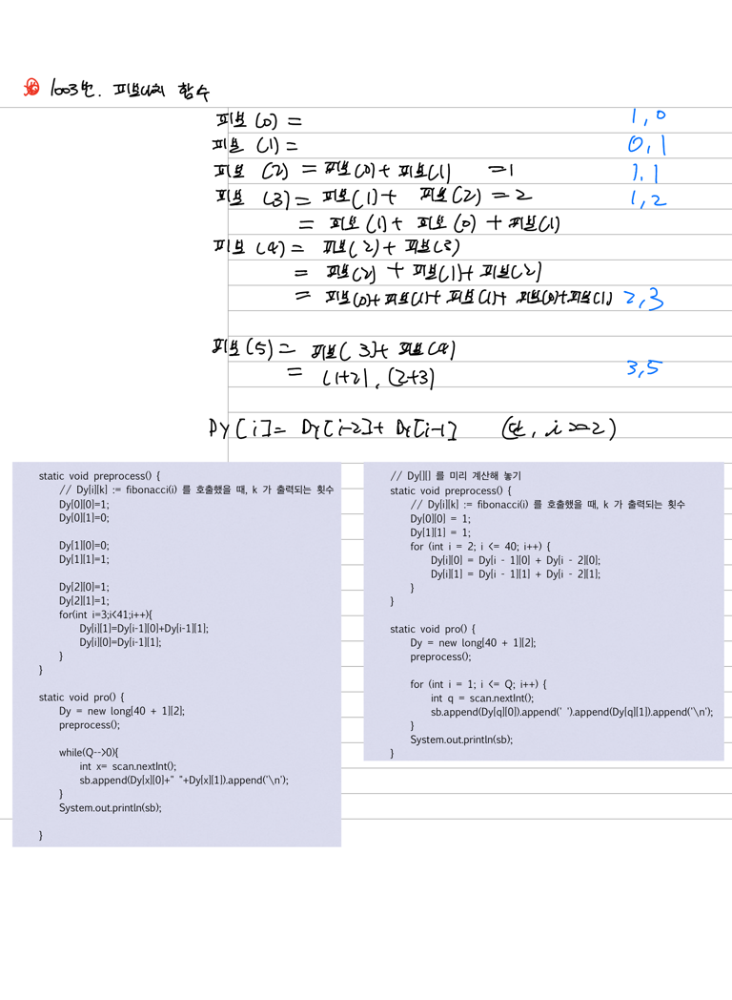
2. 10870번. 피보나치 수5
3. 15988번. 1,2,3 더하기 3
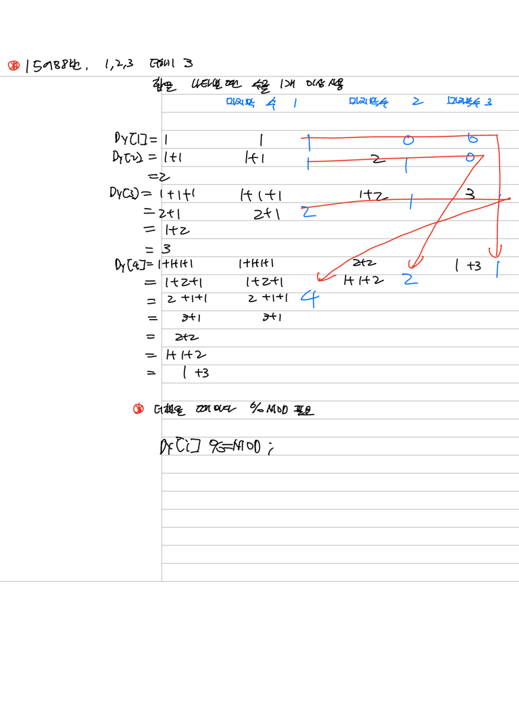

   
4. <span style="color:red"> 15991번. 1,2,3 더하기 6</span>
5. 11052번. 카드 구매하기
6. 2011번. 암호 코드


#### 기본 문제 (2)
1. 2579번. 계단오르기
2. 11057번. 오르막 수


#### 기본 문제
1. 9095번. 1,2,3 더하기
2. 11726번. 2xn 타일링
3. 2579번. 계단오르기
4. 11057번. 오르막 수
5. 11066번. 파일 합치기
6. 15681번. 트리와 쿼리